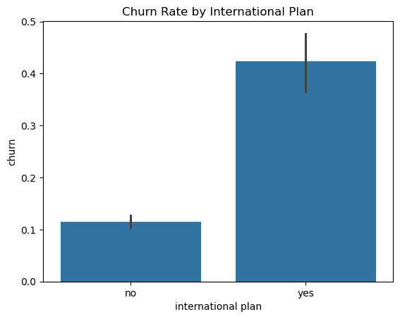
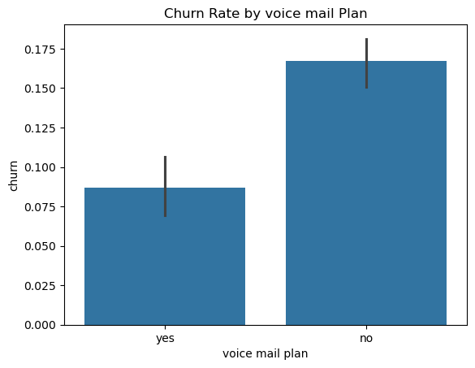
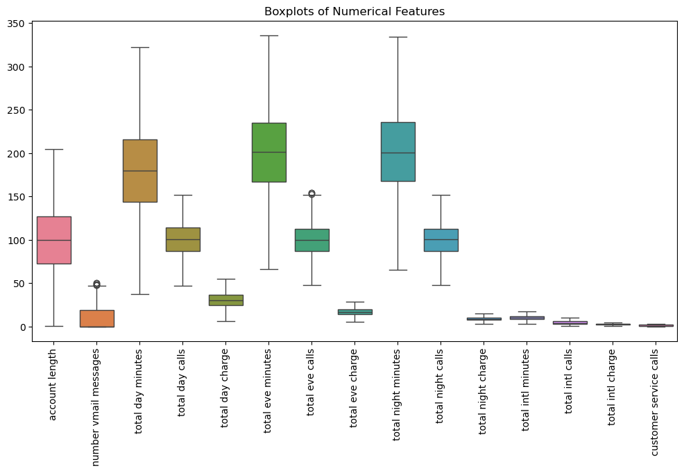
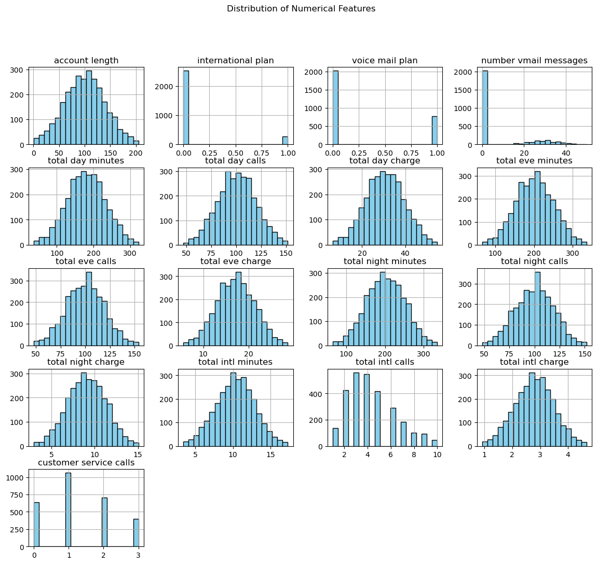
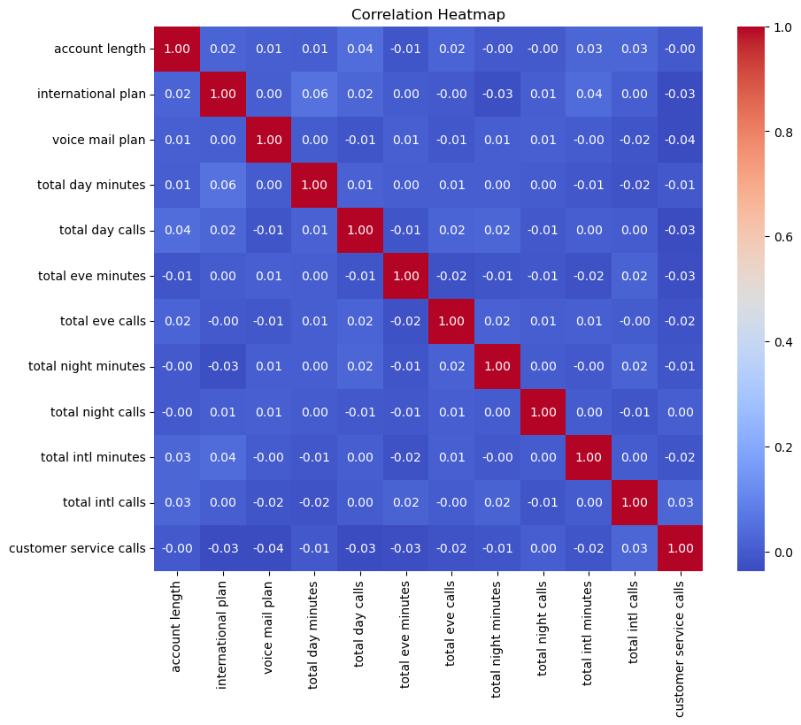
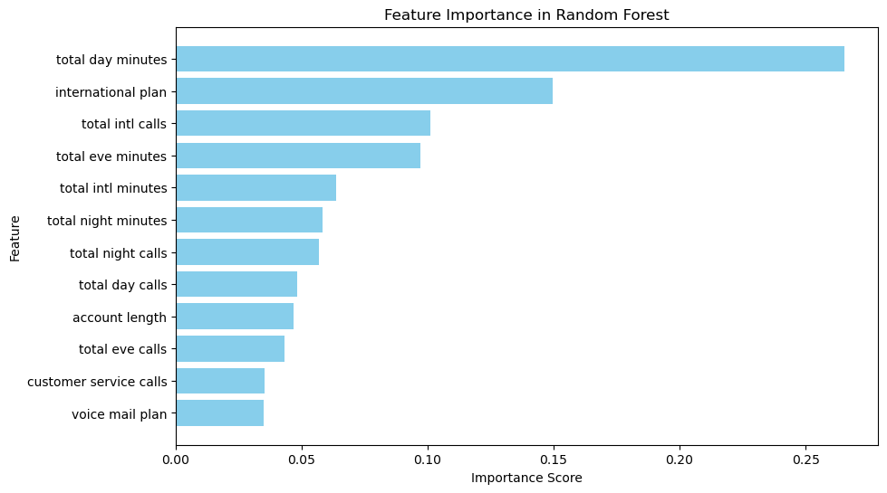

# Churn Analysis for SyriaTel

This project analyzes customer churn for SyriaTel, a telecommunications company, using predictive modeling techniques and data visualization. The goal is to understand patterns in customer behavior and develop a model to predict churn.

## Contents

### 1. Introduction
- **Business Context**: Customer churn represents significant revenue loss for telecom companies. Understanding churn patterns is crucial for retention strategies.
- **Objective**: Develop a predictive model to identify customers likely to churn, enabling proactive intervention.

### 2. Dataset Description
The dataset includes:
- **Customer Demographics**: account length, phone number etc.
- **Usage Metrics**: Daytime calls, Evening calls,Nighttime calls, International calls etc.
- **Service Details**: Customer service calls, customer support interactions.
- **Churn Status**: Binary target variable (`Yes`/`No`).

### 3. Data Preprocessing
- **Handling Missing Values**: Missing values were identified and imputed using mean/mode techniques where appropriate.
- **Feature Encoding**: Categorical variables were encoded using one-hot encoding.
- **Feature Scaling**: Numerical features were standardized to improve model performance.
- **Categorical features relationship vs Churn**

### 4. Exploratory Data Analysis (EDA)
EDA revealed key insights into churn patterns:

- **Detecting Outliers**:
  Detect outliers in numerical features, helping visualize data distribution and identify extreme values that could impact analysis or modeling.

  
- **Onehotencoding**:
  Mapping whatever is 'yes' to 1 and 'no' to 0 in the 'international plan' and 'voice mail' columns

- **Distribution of the numerical features**:
  Analyzing the numerical features distributions
  

  **Multicollinearity of data**
  Removing highly correlated features that may not provide additional useful information for modeling.
  

### 5. Model Development
- Models developed include:
  - Logistic Regression
  - Random Forest
  - Gradient Boosting
- **Evaluation Metrics**:
  - Accuracy
  - Precision, Recall, F1-Score
  - ROC-AUC Curve

#### Key Model Insights:
- **Feature Importance**:
  The following chart shows the top features influencing churn predictions.

  

### 6. Results and Interpretation
- The Random Forest model achieved the highest accuracy at 100%.
- Key predictors of churn included:
  - call usage patterns (minutes and international calls)
  - subscription plans (international plan)
  
  ### 7. Recommendations
- **Monitor Usage Patterns**: Identify customers with unusually high daytime call minutes and assess their satisfaction levels through surveys or feedback channels.
- **Introduce Daytime Offers**: Provide special discounts or loyalty rewards for heavy daytime callers to increase satisfaction and loyalty.
- **Optimize Pricing Plans**: Revisit pricing strategies for high-call-volume customers during peak hours.
- **Enhance International Plans**: Offer competitive international call rates and expand plan options to better cater to customer needs.
- **Targeted Retention Campaigns**: Create promotional offers for international plan users, such as bonus minutes or temporary discounts.
- **Improve Communication**: Clearly highlight the value and benefits of international plans through marketing campaigns.
- **Introduce Loyalty Programs**: Reward frequent international callers with bonus minutes or cashback offers.
- **Assess Service Quality**: Regularly monitor international call quality and address service disruptions promptly.
- **Bundle Services**: Offer attractive bundled plans that include both domestic and international benefits to improve retention.
- **Usage-Based Discounts**: Provide tiered pricing plans or rewards based on call volume to incentivize continued usage.
- **Focus on Long-Tenure Customers**: Offer loyalty rewards or exclusive perks to customers who have been with the company for a significant period.
- **Identify At-Risk Customers**: Monitor behavior changes in long-term customers (e.g., reduced usage) as early indicators of potential churn.
- **Improve First-Call Resolution**: Ensure customer service issues are resolved effectively during the first interaction.
- **Proactive Follow-Up**: Contact customers after service calls to confirm issue resolution and satisfaction.
- **Monitor Relevance**: Periodically assess the demand for voice mail plans to determine if they remain a valuable offering.
- **Reallocate Resources**: Focus on enhancing features with higher churn impact instead of allocating significant resources to voice mail plans.

### 9. References
- Dataset Source: *(https://www.kaggle.com/datasets/becksddf/churn-in-telecoms-dataset).
- Libraries Used: Pandas, NumPy, Scikit-learn, Matplotlib, Seaborn
